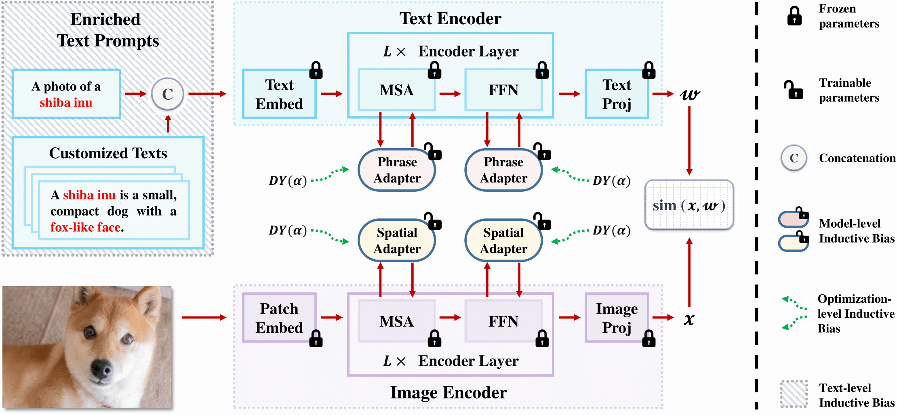

## [**Learning with Enriched Inductive Biases for Vision-Language Models (IJCV2025)**](https://link.springer.com/article/10.1007/s11263-025-02354-1)<br>
[Lingxiao Yang](https://zjjconan.github.io/), [Ru-Yuan Zhang](https://ruyuanzhang.github.io/), [Qi Chen](https://scholar.google.com.hk/citations?user=TL4VFM4AAAAJ&hl=zh-CN), [Xiaohua Xie](https://cse.sysu.edu.cn/content/2478)<br>
Sun Yat-sen University, Shanghai Jiao Tong University<br>
IJCV2025

## Highlights



> **<p align="justify"> Abstract:** Vision-Language Models, pre-trained on large-scale image-text pairs, serve as strong foundation models for transfer learning across a variety of downstream tasks. For few-shot generalization tasks, ie., when the model is trained on few-shot samples and then tested on unseen categories or datasets, there is a balance to be struck between generalization and discrimination when tweaking these models. Existing approaches typically rely on one or two strategies during training to learn task-specific knowledge, while preserving as much task-agnostic representation as possible. However, these methods overlook the importance of other useful inductive biases, thereby limiting their generalization capabilities. In this work, we propose a method–Learning with Enriched Inductive Biases (LwEIB)–to explore multiple inductive biases at the text, model, and optimization levels. Specifically, we first propose to enrich the handcrafted text prompt with Large Language Model generated descriptions for each category. To better capture structural cues in both linguistics and vision, we design two new adapters for text and image encoders, respectively. Additionally, we propose a slow-fast optimization method to explore different degrees of adaptation more efficiently, learning task-specific representations while maintaining task-agnostic ones. We empirically validate the effectiveness of LwEIB on three widely used benchmarks. Remarkably, our LwEIB outperforms numerous state-of-the-art methods across all evaluation metrics, demonstrating its efficacy and versatility. </p>

## Contributions

- We propose a novel parameter-efficient fine-tuning framework – Learning with Enriched Inductive Biases (LwEIB) that can be trained end-to-end to leverage multiple inductive biases. <p></p>
- We propose three levels of inductive biases, *i.e.*, textlevel, model-level and optimization-level, inductive biases, to increase the generalizability of VLMs in fewshot settings. <p></p>
- We evaluate LwEIB on three widely used and challenging few-shot generalization tasks. Experimental results show that LwEIB achieves leading performance among all compared methods in all evaluated benchmarks.

## All Results over Three Benchmarks
Results reported below are average accuracy across 11 recognition datasets over 3 seeds. Please refer to our paper for more details.

| Method | Base2New (HM) | Cross-Datasets | Domain Generalization | Avg |
| -----: | :-----------: | :------------: | :-------------------: | :-: |
| [CLIP](https://arxiv.org/abs/2103.00020)      | 71.70 | 65.15 | 57.18 | 64.67
| [CoOp](https://arxiv.org/abs/2109.01134)      | 71.66 | 63.88 | 59.28 | 64.94
| [CoCoOp](https://arxiv.org/abs/2203.05557)    | 75.83 | 65.74 | 59.91 | 67.16
| [MaPLe](https://arxiv.org/abs/2210.03117)     | 78.55 | 66.30 | 60.27 | 68.37
| [PromptSRC](https://arxiv.org/pdf/2307.06948) | 79.97 | 65.81 | 60.65 | 68.81
| [HPT](https://arxiv.org/pdf/2312.06323)       | 80.23 | 67.74 | 60.71 | 69.56
| **LwEIB (Paper)**                             | 81.21 | 68.61 | 60.84 | 70.22
| **LwEIB (This repo)**                         | 81.18 | 68.79 | 60.83 | **70.27**
------------------------------------------------------------
<p></p>

Some hyper-parameters in **configs** are slightly differeces to our paper, which provides a better average performance over three benchmarks (see above). 

<p></p>

We provide all trained models and logs, based on this repo, to reproduce the results (**70.27**) on [BaiduYunPan](https://pan.baidu.com/s/1ZEsQBNOqO7HrrU3tczHeGA) (passcode: **6hge**) and [Google Drive](https://drive.google.com/drive/folders/12UMfd9ECXS3WvauXOtn7W0muzSNTVHwf?usp=drive_link).


## Installation 
This code is built on top of the awesome project - [CoOp](https://github.com/KaiyangZhou/CoOp), so you need to follow its setup steps:

First, you need to install the `dassl` environment - [Dassl.pytorch](https://github.com/KaiyangZhou/Dassl.pytorch). Simply follow the instructions described [here](https://github.com/KaiyangZhou/Dassl.pytorch#installation) to install `dassl` as well as PyTorch. After that, run `pip install -r requirements.txt` under `VLM-LwEIB/` to install a few more packages required by [CLIP](https://github.com/openai/CLIP) (this should be done when `dassl` is activated).

Second, you need to follow [DATASETS.md](docs/DATASETS.md) to install the datasets.


## How to Run
```bash
# arg1 = used gpu_id
# arg2 = seed number
# using the following command for the base2new experiment
bash run_base2new.sh 0 1

# using the following command for the cross-datasets and domain-generalization experimetns
bash run_xd.sh 0 1
```

------------------------------------------------------------

## Citation
If you find our work or this repo helpful for your research, please kindly cite the following paper:

```bash
@article{LwEIB-Yang2025,
  title={Learning with Enriched Inductive Biases for Vision-Language Models},
  author={Yang, Lingxiao and Zhang, Ru-Yuan and Chen, Qi and Xie, Xiaohua},
  journal={International Journal of Computer Vision},
  year={2025},
  publisher={Springer}
}
```

## Acknowledgements
Our code is based on [Co-CoOp](https://github.com/KaiyangZhou/CoOp), [CoOp](https://github.com/KaiyangZhou/CoOp) and [MMA](https://github.com/ZjjConan/VLM-MultiModalAdapter) repositories. We thank the authors for releasing their codes.
